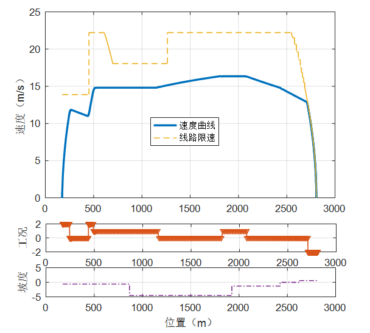
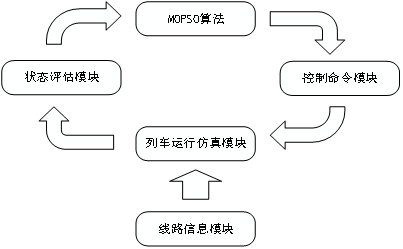

FMOPSOTrainControl:Using MOPSO algorithm to optimize traction energy consumption of subway
language：MATLAB

项目名称：基于FMOPOS算法的城轨列车牵引能耗优化

简介
其中列车计算模块通过通过数值方法对列车的动力学微分方程进行求解，能够计算牵引、巡航、惰性和制动四种工况下的列车运行状态，输出位置、速度和能耗等信息。控制命令模型，能够将根据工况序列和切换点将输出列车在不同的位置对应的控制命令，使列车按预定方式运行。状态评估模型能够接收列车计算模块输出的列车状态信息，根据评估隶属度函数对优化指标进行评价。

MOPSO算法模块从优化指标评估模块获得每个种群粒子的适应度，然后进行相应的筛选、保留和迭代操作。

列车运行仿真模块由牵引力子模块、制动力子模块、运行阻力子模块和延迟子模块几部分组成。牵引力模块根据控制指令控制牵引力的大小，当控制指令的值为正时输出牵引力，牵引力的大小与控制指令的大小成正比。同时根据列车的牵引特性曲线，限制输出牵引力不超过当前情况下允许的最大值。当控制指令为负值时，制动力模块会输出制动力，其大小与控制指令的绝对值成正比。同时根据列车的制动特性曲线，限制输出制动力的不超过当前情况下的最大值。阻力模块根据列车运行过程中的速度和线路坡度，计算输出列车的运行阻力。由于列车的动力系统可以近似看作是一阶惯性系统，所以牵引力和制动力的改变会存在延迟。所以动力系统的输出会经过延迟模块再影响列车的运行状态。

由工况转换点到列车速度曲线的求解需要求解列车动力学微分方程，这里采用欧拉法和Runge-Kutta 法求解。
其中欧拉法是固定步长的，步长设置在arginitial.m文件中。
                   TMSTEPLEN=0.1;                  %仿真时间步长
Runge-Kutta是自动步长的。

在该仿真平台里提供了PSO算法和MOPSO算法两种类型的寻优算法。
PSO算法是对多目标进行加权求和比较解的优劣的。
MOPSO算法是采用Pareto最优的形式比较解的优劣的。

图片中红色部分代表的是列车工况：2――牵引；1――巡航；0――惰行；-1――制动

代码组成：
	1.列车运行仿真代码; 
			./train_dynamic_model
			

	2.FMOPSO代码；
			./FMOPSO

	3.PSO代码;
			./PSO	

	4.算法工具
			./tool

	5.主仿真程序
			pso_main.m：采用pos算法进行优化的主仿真程序
			mopso_main.m：采用多目标pos算法进行优化的主仿真程序
			arginit.m ：初始化线路数据
	
注意运行程序时将当前文件夹下所有文件夹添加到Matlab路径

	

算法参数设置
1.列车线路参数:arginit.m ：初始化线路数据

2.FMOPSO参数：FMOPSOmain.m 初始多目标粒子群算法参数

3.算法出图：CalcEJT.m 辅助参数为1时出图

参数说明

